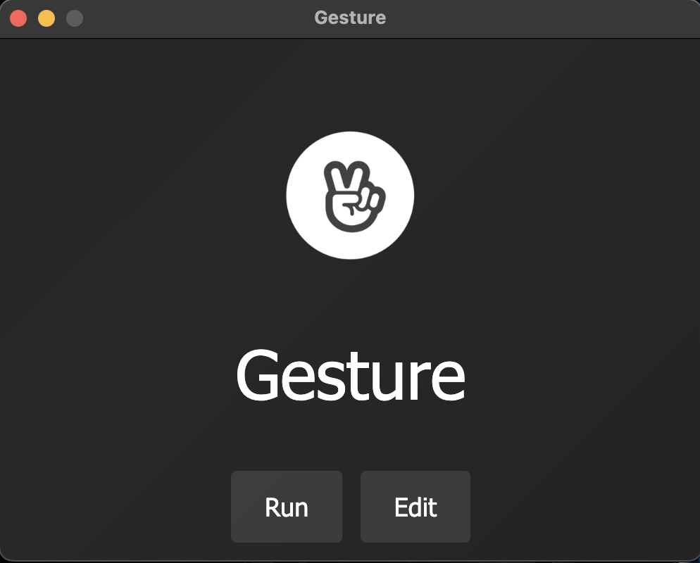
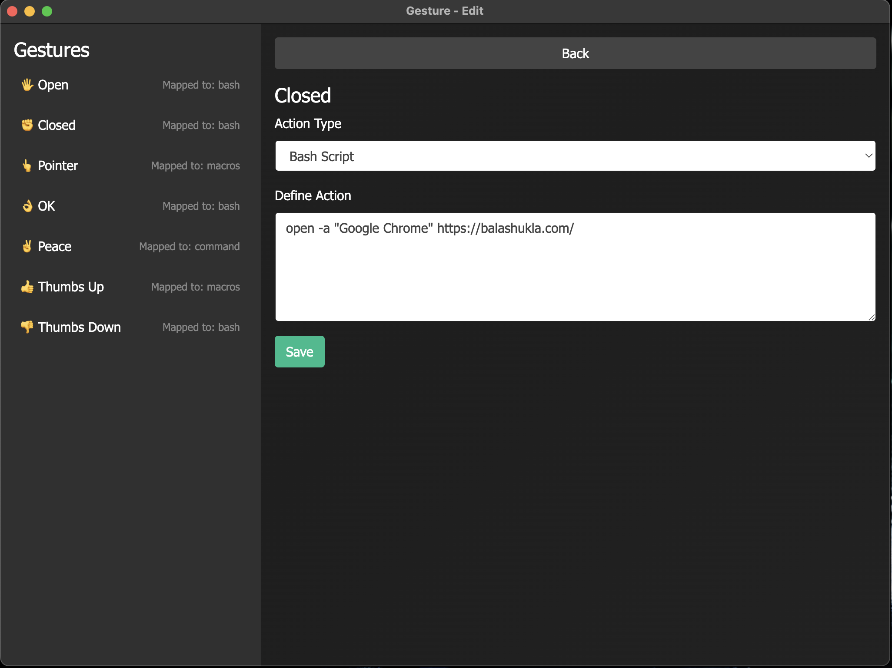

# Gesture: Revolutionizing System Automation with Hand Gestures



## Introduction
**Gesture** is a software that utilizes hand gesture detection using **Mediapipe**, which allows users to interact with their screen purely through the use of their hand signs. Users are capable of configuring their own options for what interaction each hand gesture will make 

---

## Problem Statement
Traditional input methods, such as keyboards and mice, can be limiting, especially in scenarios that demand hands-free interaction, greater accessibility, or enhanced efficiency. Gesture addresses these challenges by enabling users to control their systems using hand gestures, which are:

- **Intuitive**: Natural movements for seamless interaction.
- **Efficient**: Automates repetitive tasks in a fraction of the time.
- **Customizable**: Users can assign their own commands to gestures.
- **Accessible**: Designed to assist users with physical disabilities or those in environments where traditional input is impractical.



---

## Key Features
1. **Gesture Recognition**: Accurate real-time hand tracking and gesture classification powered by OpenCV and MediaPipe.
2. **Custom Command Mapping**: Assign personalized commands to gestures, such as:
   - Taking a screenshot with a simple hand sign.
   - Opening a browser with a wave.
   - Locking the screen with a gesture.
3. **Advanced AI Integration**: CNNs trained with TensorFlow ensure robust gesture recognition, even in challenging environments.
4. **Cross-Platform Support**: An Electron-based desktop app that works on Windows, macOS, and Linux.

---

## How It Works
The system operates using a multi-stage pipeline:

1. Input images are processed using **OpenCV** and passed through a **hand detection neural network**.
2. Detected hand landmarks are fed into a **convolutional neural network (CNN)** for feature extraction.
3. A **feed-forward neural network** classifies the gestures into predefined or user-defined categories.

The flowchart below illustrates the pipeline:


---

## Technologies Used
- **OpenCV**: For real-time video capture and preprocessing.
- **MediaPipe**: For hand landmark detection and tracking.
- **TensorFlow**: For training and deploying CNNs for gesture classification.
- **Electron**: To build a cross-platform desktop application.

---

## Installation
To get started with Gesture, follow these steps:

```bash
# Clone this repository:
git clone https://github.com/junw000/Gesture.git

# Install dependencies:
cd Gesture
pip install -r requirements.txt
npm install

# Start the application:
npm start
```
